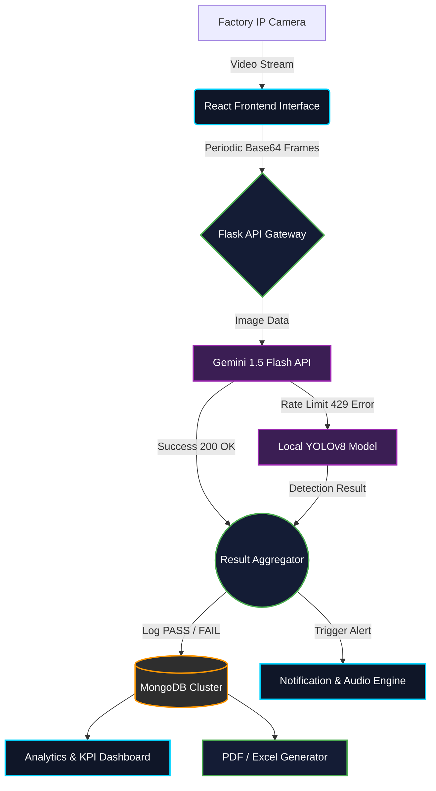

<div align="center">
  
  <h1>🏭 QUALITRON AI — Enterprise Quality Control</h1>
  
  <p><b>Next-Generation Visual Inspection System powered by Gemini 1.5 Pro & YOLOv8</b></p>
  
  <p>
    <a href="https://qualitron-frontend.onrender.com" target="_blank">
      
    </a>
  </p>

  [](https://www.python.org/)
  [](https://reactjs.org/)
  [](https://flask.palletsprojects.com/)
  [](https://www.mongodb.com/)
  [](https://github.com/ultralytics/ultralytics)
  [](https://ai.google.dev/)
</div>

<br/>

> **Qualitron AI** bridges the gap between traditional computer vision and modern Large Vision-Language Models (VLMs). By deploying a dual-engine architecture, it delivers **zero-downtime, sub-second latency** defect detection for high-speed manufacturing conveyor belts.

---

## 🌟 Executive Summary

In modern manufacturing facilities, visual inspection is often the bottleneck in the production pipeline. Human inspectors are prone to fatigue, while traditional rule-based cameras lack the intelligence to identify complex, unseen defects. 

**QUALITRON AI** solves this by leveraging a **Hybrid AI Pipeline**. It uses Google's powerful **Gemini 1.5 Flash** for high-reasoning tasks (identifying microscopic cracks, shape deformities, and color anomalies) and seamlessly falls back to a locally hosted **YOLOv8 Edge Model** if network limits are reached. This guarantees **100% operational uptime** on the factory floor.

---

## 🔥 Enterprise-Grade Features

### 🧠 1. Hybrid AI Resilience Engine
- **Primary VLM Engine:** Utilizes Google Gemini 1.5 Flash for deep contextual understanding of defects.
- **Auto-Failover Protocol:** If API rate limits (HTTP 429) occur, the system instantly hot-swaps inference to a local YOLOv8 neural network.
- **Latency Optimization:** Real-time base64 frame compression before transmission to cloud endpoints.

### 🎥 2. Live Conveyor Monitor
- **Hardware Integration:** Connects to IP Cameras or factory webcams to process live continuous video feeds.
- **Bounding Box Overlay:** Dynamically draws detection boxes and confidence scores directly on the live video stream.
- **Industrial Alerts:** Triggers a distinct, high-frequency **Sawtooth Audio Alarm (Triple-Beep)** instantly upon detecting defective units.

### 📈 3. Big Data Analytics & KPIs
- **Live Dashboard:** Displays real-time metrics including *Total Inspected*, *Current Defect Rate*, and *Average AI Accuracy*.
- **Defect Distribution:** Categorical breakdown of defect types (e.g., Scratches vs. Dents) for root-cause analysis.
- **Machine Health Predictive Scoring:** Algorithms predict which manufacturing machines need maintenance based on historical defect data.

### 📄 4. Automated Compliance Reporting
- **PDF Generation (ReportLab):** 1-Click generation of beautiful, factory-ready PDF reports containing structured inspection logs.
- **Excel Export (OpenPyXL):** Export deep analytical data into `.xlsx` format, complete with auto-generated charts for management review.

### 🔐 5. Role-Based Access Control (RBAC)
- **Quality Engineer Mode:** Full access to system configuration, camera settings, and database wipe controls.
- **Floor Employee Mode:** Restricted 'View-Only' access to the Live Monitor and Dashboard, preventing accidental misconfigurations.

---

## 🏗️ System Architecture & Workflow

The architecture is designed using a decoupled Client-Server model, ensuring that the heavy AI inference does not block the UI thread.



---

## 🛠️ Comprehensive Technology Stack

| Layer | Technologies Used | Purpose |
| :--- | :--- | :--- |
| **Frontend Framework** | `React 18`, `Vite` | Lightning-fast component rendering and state management. |
| **UI / UX Design** | `CSS3 Glassmorphism`, `Lucide Icons` | Highly immersive, dark-mode industrial design language. |
| **Backend Core** | `Python 3.10`, `Flask`, `Flask-CORS` | High-throughput REST API development. |
| **Authentication** | `Flask-JWT-Extended`, `Bcrypt` | Secure token-based API protection and password hashing. |
| **AI / Machine Learning** | `google-generativeai`, `Ultralytics` | Hybrid computer vision and large multimodal inference. |
| **Database Layer** | `PyMongo`, `MongoDB Atlas` | Scalable NoSQL storage for millions of inspection records. |
| **Data Processing** | `OpenCV`, `NumPy`, `Pillow` | Frame extraction, resizing, and array manipulation. |
| **Reporting Engine** | `ReportLab`, `OpenPyXL` | Dynamic generation of strict formatting documents. |
| **Cloud Deployment** | `Render.com` | Continuous CI/CD deployment for both frontend and backend. |

---

## 🌐 Live Cloud Deployment (Render)

This application is fully containerized and deployed on Render's cloud infrastructure.

- **Frontend Portal:** [https://qualitron-frontend.onrender.com](https://qualitron-frontend.onrender.com)
- **Backend API Base:** `https://qualitron-backend.onrender.com/api`

*(Note: The first API call might take 30-50 seconds if the free-tier backend is waking up from sleep).*

---

## 🚀 Local Developer Setup

If you wish to run the Qualitron AI Engine on your local machine for development or contributing, follow these steps:

### Prerequisites
- Python 3.10+
- Node.js v18+
- MongoDB instance (Local or Atlas)

### 1. Clone the Repository
```bash
git clone https://github.com/Nitya-Patle/QUALITRON-AI.git
cd QUALITRON-AI
```

### 2. Backend Initialization
```bash
cd backend

# Create isolated virtual environment
python -m venv venv

# Activate environment (Windows)
venv\Scripts\activate
# Activate environment (Mac/Linux)
# source venv/bin/activate

# Install core dependencies
pip install -r requirements.txt
```

Create a `.env` file in the `backend` directory to store your secrets securely:
```env
# backend/.env
MONGO_URI=mongodb+srv://<username>:<password>@cluster.mongodb.net/
GEMINI_API_KEY=AIzaSyYourGoogleGeminiKeyHere...
JWT_SECRET_KEY=super-secret-industrial-key
```

Boot the API server:
```bash
python app.py
```
*The backend will now be actively listening on `http://localhost:5000`.*

### 3. Frontend Initialization
Open a new terminal window:
```bash
cd frontend

# Install Node modules
npm install

# Start the Vite development server
npm run dev
```
*The interface will automatically open at `http://localhost:5173`.*

---

## 🔮 Future Roadmap
- [ ] **Real-time SMS/WhatsApp Integration:** Move notification toggles from mockup state to active Twilio/SendGrid integration for instant manager alerts.
- [ ] **Multi-Camera 3D Sync:** Support for 4 simultaneous camera angles (Top, Left, Right, Bottom) for comprehensive 360° item inspection.
- [ ] **Advanced Authentication System:** Proper login portals with distinct dashboards for Factory Floor Employees vs. Quality Engineers.
- [ ] **Voice Command Assistant:** Integrate a microphone feature allowing hands-free operation (e.g., "Qualitron, show critical alerts", "Generate today's PDF").
- [ ] **Dynamic Theme Toggling:** Add user preferences for switching between the current Dark Mode and a bright Light Mode UI.
- [ ] **Automated Retraining Pipeline:** Automatically push falsely classified images back to Ultralytics HUB to continuously fine-tune the YOLOv8 model.

---

<div align="center">
  <br/>
  <p><b>Designed and Developed for Advanced Quality Assurance Engineering</b></p>
  <p><i>Building the future of manufacturing, one pixel at a time.</i></p>
</div>
