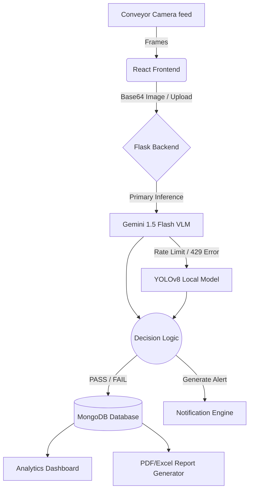

<div align="center">
  <h1>🏭 QUALITRON AI</h1>
  <p><b>Advanced Quality Control & Defect Detection System powered by Hybrid AI</b></p>

  [](https://www.python.org/)
  [](https://reactjs.org/)
  [](https://flask.palletsprojects.com/)
  [](https://github.com/ultralytics/ultralytics)
  [](https://ai.google.dev/)
</div>

<br/>

## 📖 Overview
**QUALITRON AI** is an industrial-grade Quality Control (QC) software designed to automate visual inspections in manufacturing pipelines. By combining the speed of **YOLOv8** with the reasoning capabilities of **Google Gemini 1.5 Flash**, it achieves high-accuracy defect detection in real-time, significantly reducing manual inspection errors.

---

## ✨ Key Features
- 🧠 **Hybrid AI Architecture:** Automatically falls back to YOLOv8 for inference if Gemini hits rate limits (429 errors), ensuring zero downtime.
- 📸 **Live Monitor & Hardware Integration:** Connects to factory webcams/IP cameras to scan items passing on conveyor belts in real-time.
- 🚨 **Industrial Alert System:** Custom sawtooth audio alarms (triple-beep) and robust alert feeds for critical defect notifications.
- 📊 **Real-Time Analytics & KPIs:** Dynamic dashboard tracking Pass/Fail rates, AI accuracy, and defect distributions.
- 📄 **Automated Reporting:** Generate and download highly professional PDF inspection reports and Excel datasets with a single click.
- 🔐 **Role-Based Access Control:** Secure UI mockups demonstrating distinct access levels for Quality Engineers vs. Floor Employees.

---

## 🏗️ System Architecture



---

## 💻 Technology Stack

### Frontend
- **React.js (Vite)** – Fast and modern UI framework.
- **Lucide React** – Clean industrial iconography.
- **Web Audio API** – For generating native industrial alarm sounds.
- **CSS3** – Custom glassmorphism and modern dark mode UI.

### Backend
- **Python Flask** – Lightweight and scalable REST API.
- **MongoDB** – NoSQL database for rapid inspection logging.
- **Flask-JWT-Extended** – Secure token-based authentication.
- **ReportLab & OpenPyXL** – For generating PDFs and Excel workbooks.

### AI Engine
- **Google Gemini 1.5 Flash** – Primary Vision-Language Model.
- **YOLOv8 (Ultralytics)** – Secondary fallback object detection model.
- **OpenCV** – Image processing and camera stream handling.

---

## 🚀 Installation & Setup

### 1. Clone the repository
```bash
git clone https://github.com/Nitya-Patle/QUALITRON-AI.git
cd QUALITRON-AI
```

### 2. Backend Setup
```bash
cd backend
python -m venv venv
venv\Scripts\activate  # On Windows
pip install -r requirements.txt
```
Create a `.env` file in the backend directory:
```env
MONGO_URI=your_mongodb_connection_string
GEMINI_API_KEY=your_gemini_api_key
JWT_SECRET_KEY=your_jwt_secret
```
Run the backend server:
```bash
python app.py
```

### 3. Frontend Setup
```bash
cd ../frontend
npm install
npm run dev
```

---

## 📂 Project Structure
```text
QUALITRON_AI/
├── backend/
│   ├── ai_engine/          # Gemini & YOLO fallback logic
│   ├── routes/             # REST APIs (Auth, Inspections, Reports)
│   ├── models/             # YOLO weights (best.pt)
│   ├── database/           # MongoDB configuration
│   └── app.py              # Flask Entry Point
│
├── frontend/
│   ├── src/
│   │   ├── pages/          # Dashboard, Camera, Alerts, Records
│   │   ├── components/     # Reusable UI widgets
│   │   └── utils/          # API Handlers & Audio Beeps
│   └── index.html          # React App Entry
│
└── README.md
```

---

<div align="center">
  <b>Developed with ❤️ for Advanced Software Engineering</b>
</div>
